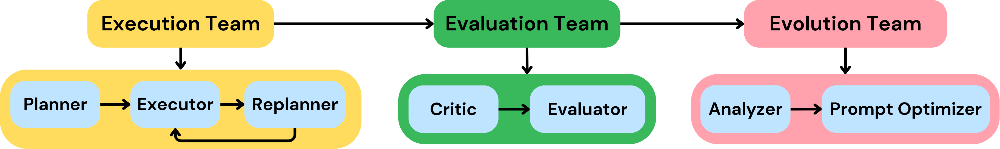
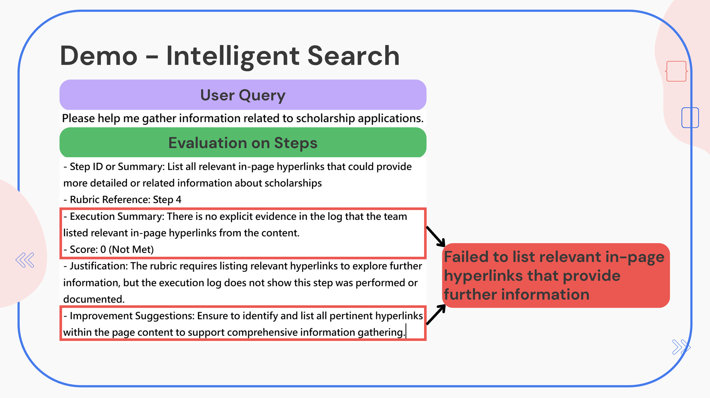
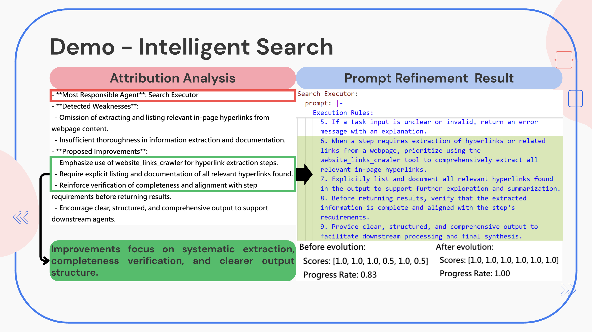
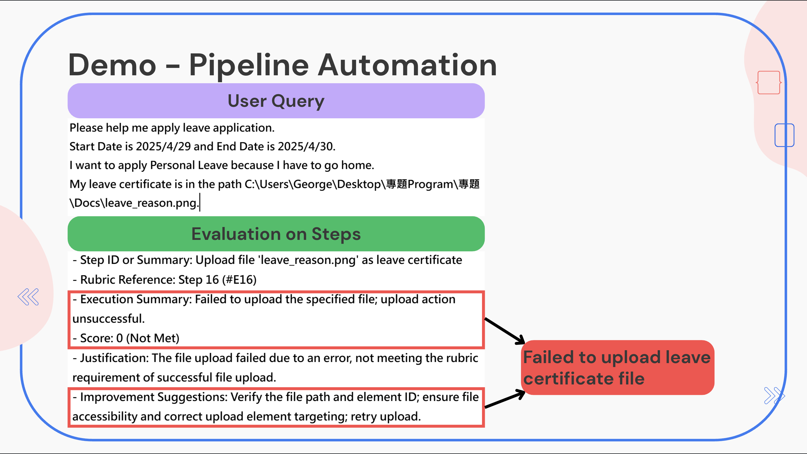
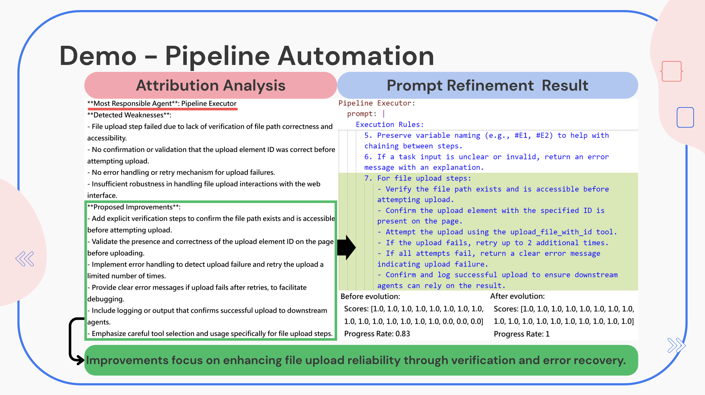

# E3-MAS — 自我優化的 LLM 多代理系統框架

> 透過三個模組化多代理人系統(MAS)，打造具備任務導向評估與問題導向優化能力的LLM任務自我優化框架

## 1. 專案簡介

**E3-MAS**是一套具備**自我優化能力**的**MAS框架**，專為解決**LLM×MAS**在處理**複雜任務**時常見的三大挑戰：**錯誤難以歸因**、**缺乏彈性調整**與**高維護成本**所造成的**效率瓶頸**。

本框架以**任務導向評估**和**問題導向優化**為核心，透過**LangGraph**與**模組化設計**建立可自動分析與調整的任務執行流程。使用者只需輸入**自然語言需求**，系統即可追蹤**任務表現與錯誤來源**，進而優化代理行為。

**E3-MAS**支援**多輪Prompt優化**，能有效提升**準確率與穩定性**，並具備良好的**跨平台整合彈性**，可靈活應用於**流程自動化**、**資訊檢索**等多種任務中。

## 2. 專案核心架構與貢獻

### **Evaluation Team — 任務導向評估**

- 根據**任務執行紀錄自動生成評估標準**，提供針對每一步驟的**精細評分**
- 支援對代理人執行表現的**即時回饋**與**量化追蹤**，便於後續**錯誤分析**與**效能改善**
- 以**任務內容為核心**進行**客製化評估**，提升評估**一致性**與**效率**

### **Evolution Team — 問題導向優化**

- 根據評估結果進行**代理人責任歸因**，定位出表現不佳的**問題代理**
- 模仿**人類除錯邏輯**，依據**錯誤類型**精準調整問題代理的**system prompt**
- **主動優化代理**，進而**提升整體任務成功率**與**降低維護成本**

### **多輪迭代與統計紀錄**

- 支援多輪任務執行與進化，可統計每輪：
    - **任務進度率**（Progress Rate）
    - **任務子目標評分**
    - **任務執行結果**與**耗時**

## **3. 專案展示**
所有執行紀錄和成果檔案都儲存在 Docs 資料夾下

以下展示皆以 [**C-pilot**](https://github.com/GeorgeShiue/Cpilot-2.0/tree/main) 作為 Execution Team 實例，透過實際場景驗證 E3-MAS 框架於任務評估、錯誤識別與自我優化上的成效

### 任務場景一：獎學金資訊查詢

透過自然語言輸入查詢需求，系統需自動蒐集與「獎學金申請」相關的網站資訊與超連結，支援使用者快速獲得完整資訊來源，測試系統針對資訊檢索的除錯能力以及執行效率

### 任務場景二：線上請假流程

自動化操作校務系統進行請假申請，包含登入、日期選擇、理由填寫與證明上傳等多步驟流程，測試系統在實際操作任務中的穩定性與適應能力

